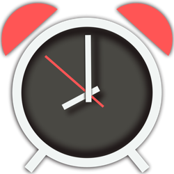

# Swift Dates

BSD. Use at your own risk.

Various datelike things. 

### Date Utilities
* Adds `sharedCalendar` and `now` as `Date` static property
* Implements date properites for time interval and component retrieval
* Date characteristics (past, future, weekend, weekday)
* Time interval between two dates, from one date to another, single component distance
* Returning days/hours/minutes/seconds to another date
* Offsets (dhms) to another date
* Nearest hour and minute
* Start of day, end of day, end of today, start of week, next week, last week, this week, start of year, next year, last year
* Today, tomorrow, yesterday for real time and for a given date
* Whether two dates are on the same day, same week, same year

### Date Math
* Common time intervals (smhdw)
* Integer interval math (1.day, 2.weeks, etc, smhdw)
* Date + Components
* Components +/- Components

### Date Formatting
* ISO 8601 formatter, short/medium/long/full date and time formatters
* ISO 8601/short/medium/long/full date strings
* Short/medium/long/full time strings

### Calendar Utilities
* Comprehensive `component(of date: Date)` for all standard components, for any calendar.

### Date Component Utilities
* Common, comprehensive, MDY, HMS, MDYHMS component sets
* Common, comprehensive, MDY, HMS, and MDYHMS component date properties
* Populate date components by single MDYHMSn component counts
* Offset date by `count` of a single component: 
	* `offset(_ component: Calendar.Component, _ count: Int) -> Date`
* Date component subscripting
* Initialize date components from time interval `DateComponents(ti:)`
* Return a set of `members` making up an individual date component instance
* Standardization: `trimmed` (zero-valued components removed, `normalized` (all positive values), `timeInteval` (representation of the date components as a time interval offset from the reference date)
* Presentation: standard, relative, approximate

```
let dc = DateComponents(minute: 7, second: 5)
print(dc.description(remaining: true, approximate: true)) 
// About 7 minutes, 5 seconds remaining
print(dc.description(style: .approximate)) 
// About 7 minutes from now
print(dc.description(style: .relative)) 
// 7 minutes, 5 seconds from now
print(dc.description(style: .standard)) 
// 7 minutes, 5 seconds
let units: [DateComponentsFormatter.UnitsStyle] = 
    [.positional, .abbreviated, .short, .full, .spellOut]
// 7:05, 7m 5s, 7 min, 5 sec, 7 minutes, 5 seconds, seven minutes, five seconds
```